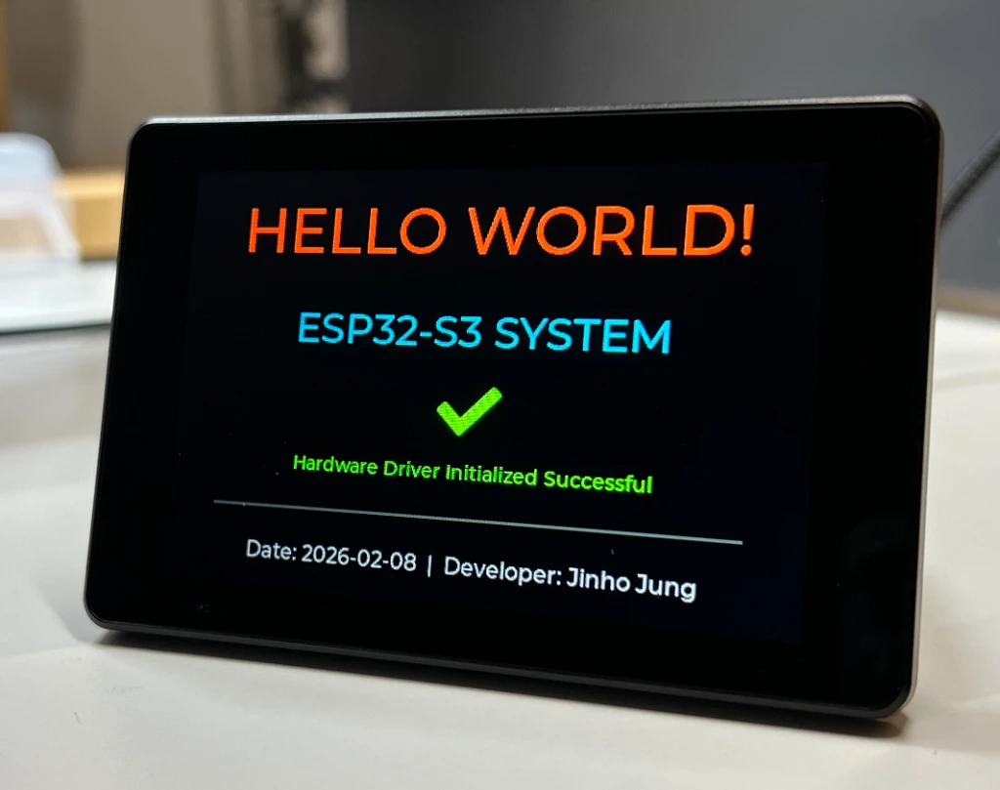
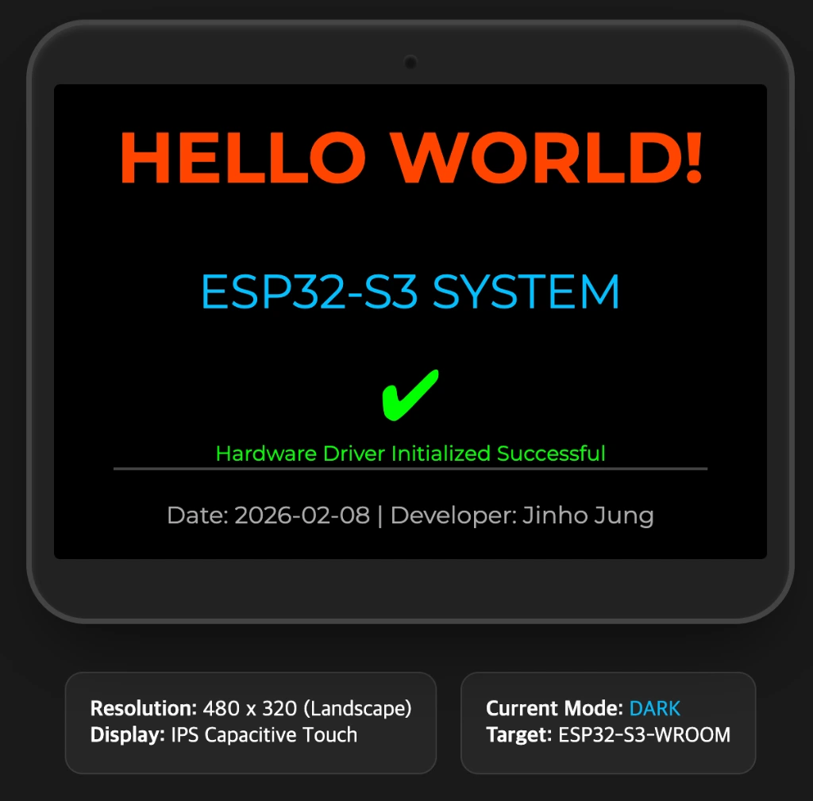
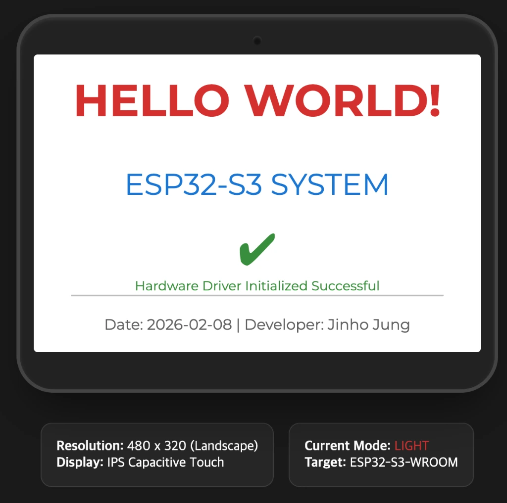

# 📟 ESP32-S3 3.5" Smart Display Project

이 프로젝트는 Sunton ESP32-S3 3.5인치 QSPI 디스플레이 보드를 위한 **LVGL 기반 시스템 인터페이스**입니다. 제조사 전용 드라이버를 아두이노 환경에 최적화하여 빌드 및 구동에 성공한 상태입니다.



| Theme: DARK | Theme: LIGHT | Theme: LOW_POWER |
| :---: | :---: | :---: |
|  |  |  |


---

## 🛠️ 개발 환경 매뉴얼 (Arduino CLI)

이 프로젝트는 모든 빌드와 업로드를 통합 터미널에서 **Arduino CLI**를 사용하여 진행합니다.

### 1. 전제 조건

- **보드 매니저:** `esp32:esp32` (v3.3.6 설치 완료)
- **라이브러리:** `lvgl` (v8.3.9 설치 완료)
- **포트:** `/dev/cu.usbmodem2101` (시스템 상황에 따라 변경될 수 있음)

### 2. 핵심 명령어 (Cheat Sheet)

#### ✅ 컴파일 (빌드)

코드를 수정하신 후 다음 명령어를 터미널에 입력하세요.

```bash
arduino-cli compile --fqbn esp32:esp32:esp32s3:CDCOnBoot=cdc,FlashSize=16M,PartitionScheme=app3M_fat9M_16MB,PSRAM=opi .
```

#### ✅ 업로드

빌드가 완료된 결과물을 보드에 올립니다. (동작 안 할 시 Boot+RST 콤보 사용)

```bash
arduino-cli upload -p /dev/cu.usbmodem2101 --fqbn esp32:esp32:esp32s3:CDCOnBoot=cdc,FlashSize=16M,PartitionScheme=app3M_fat9M_16MB,PSRAM=opi .
```

#### ✅ 시리얼 모니터

보드에서 전송하는 디버그 메시지를 확인합니다. (종료: Ctrl+C)

```bash
arduino-cli monitor -p /dev/cu.usbmodem2101 -c baudrate=115200
```

---

## 📂 파일 구조 설명

- **`HelloWorld.ino`**: 메인 로직 및 UI 구성 파일.
- **`esp_bsp.*` / `esp_lcd_axs15231b.*`**: 고성능 QSPI 디스플레이 구동을 위한 전용 드라이버.
- **`lv_conf.h` / `lv_port.*`**: LVGL 그래픽 엔진 설정 및 포팅 레이어.
- **`display.h`**: 해상도 및 핀 맵 정의 파일.

---

## 🎨 현재 UI 구현 상태 (v1.5 - 2026-02-08)

- **배경:** 시크한 블랙 (`0x000000`)
- **상단:** `HELLO WORLD!` (오렌지레드, 상단 여백 20px로 최적화)
- **중앙:** `ESP32-S3 SYSTEM` (스카이블루, 중앙에서 상향 배치)
- **아이콘:** **✅ 대형 OK 심볼** (`LV_SYMBOL_OK`, 초록색, 48px) 추가
- **하단:** 개발자 정보 및 날짜 표기 (그레이 폰트)
- **레이아웃:** 요소 간 간격을 좁히고 전체 위치를 상향 조정하여 하단 겹침 문제 해결.

---

## 🆙 업데이트 기록 (Changelog)

### [v1.5] - 2026-02-08

- **날짜 및 빌드 환경 최적화**: 2026-02-08 기준 최신화.
- **경로 공백 대응**: 폴더명 공백으로 인한 빌드 오류를 임시 경로 빌드 방식으로 해결.
- **코드 정리**: 메인 파일명을 `HelloWorld.ino`로 일원화.

### [v1.4] - 2026-02-04

- **저전력 모드(LOW_POWER) 추가**: 터치 시 DARK -> LIGHT -> LOW_POWER 순으로 순환.
- **부드러운 전환 효과**: LVGL Transition 기능을 활용한 색상 변화 및 백라이트 밝기가 서서히 변하는 애니메이션 적용.
- **에뮬레이터 동기화**: `emulator.html`에서도 기기와 동일한 테마 순환 및 밝기 시뮬레이션 지원.
- **UI 보정**: 저전력 모드에서 체크 아이콘 성능 가독성을 위해 밝기 75%(`0x00BF00`) 유지.

### [v1.2] - 2026-02-04

- **테마 전환 추가:** 화면 터치 시 라이트/다크 모드 실시간 전환 기능 구현.
- **체크 아이콘:** LVGL 빌트인 심볼(OK)을 활용한 상태 표시 아이콘 추가.
- **UI 최적화:** 텍스트 간격 조정 및 요소 상향 배치를 통한 레이아웃 개선.

---

## 🚀 향후 계획 (Next Steps)

1. **터치 기능 활성화:** `esp_lcd_touch` 레이어를 연결하여 버튼 입력을 처리합니다.
2. **PSRAM 활용:** 8MB의 풍부한 PSRAM을 활용하여 더 화려한 애니메이션을 추가합니다.
3. **위젯 확장:** 실시간 시계 또는 센서 데이터 모니터링 UI를 구성합니다.

---

**Developer:** Jinho Jung  
**Last Updated:** 2026-02-08
