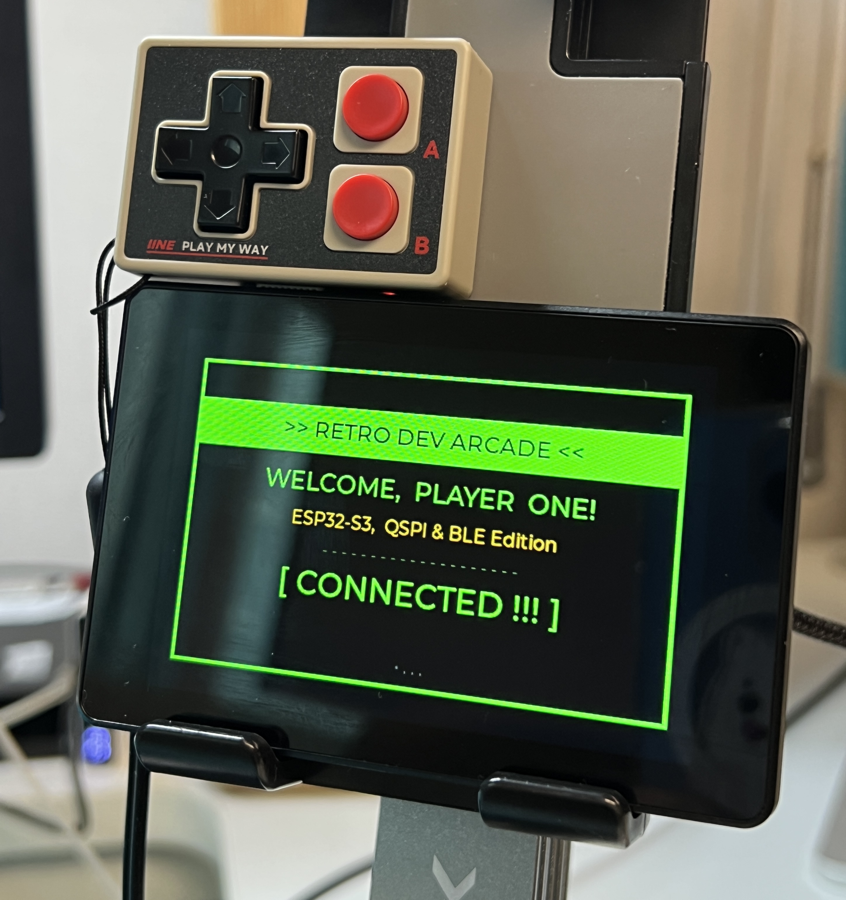

# ESP32-S3 QSPI BLE GamePad v1.0

ESP32-S3 + 3.5" QSPI 디스플레이 + BLE HID 게임패드 통합 프로젝트.
LVGL 4페이지 UI를 BLE 게임패드 버튼과 터치 제스처로 조작합니다.



---

## Hardware

| 항목 | 사양 |
|------|------|
| MCU | ESP32-S3, Dual-Core LX7 @ 240 MHz |
| Flash / PSRAM | 16 MB / 8 MB OPI |
| Display | 3.5" TFT, AXS15231B, QSPI, 320×480, RGB565 |
| Backlight | GPIO1 (LEDC PWM) |
| Touch | I2C Capacitive (SCL: GPIO8, SDA: GPIO4) |
| Gamepad | IINE L1161 (Xbox Wireless Controller mode) |

---

## Features

**4페이지 UI** — Welcome / Hardware / Software / Input Monitor

| 입력 | 동작 |
|------|------|
| A 버튼 | 밝기 순환: 20 → 40 → 60 → 80 → 100 → 20… |
| B 버튼 | 페이지 순환: 1 → 2 → 3 → 4 → 1… |
| 좌우 스와이프 | 이전 / 다음 페이지 |
| 상하 스와이프 | 밝기 ±20% |

- BLE 자동 스캔 / 재스캔 (5초 간격)
- 밝기 OSD — 우측 세로 5단계 세그먼트 바, 2초 후 자동 숨김

---

## BLE HID Report (IINE L1161, 17 bytes)

| Byte | 내용 |
|------|------|
| [1] | Left-stick X (center 0x80) |
| [3] | Left-stick Y (center 0x80) |
| [12] | D-pad / HAT (lower nibble) |
| [13] | Face buttons — A=0x01 B=0x02 X=0x04 Y=0x08 |
| [14] | Extra — Menu=0x01 View=0x02 |

---

## Build & Upload

```bash
# 컴파일
arduino-cli compile \
  --fqbn esp32:esp32:esp32s3:CDCOnBoot=cdc,FlashSize=16M,PartitionScheme=app3M_fat9M_16MB,PSRAM=opi \
  .

# 업로드
arduino-cli upload \
  -p /dev/cu.usbmodem2101 \
  --fqbn esp32:esp32:esp32s3:CDCOnBoot=cdc,FlashSize=16M,PartitionScheme=app3M_fat9M_16MB,PSRAM=opi \
  .

# 시리얼 모니터
arduino-cli monitor -p /dev/cu.usbmodem2101 -c baudrate=115200
```

**Prerequisites:** `esp32:esp32` v3.3.6, `lvgl` v8.3.9

> 업로드 실패 시 **Boot + RST** 버튼을 동시에 눌러 부트로더 모드 진입

---

## Stack

```
ESP32_BLE_GamePad.ino    ← Application (LVGL UI + BLE HID Central)
    esp_bsp.c/h          ← QSPI display, backlight PWM, I2C touch init
    esp_lcd_axs15231b    ← AXS15231B panel driver (67-cmd init sequence)
    lv_port.c/h          ← LVGL ↔ FreeRTOS bridge (DMA flush, TE vsync)
    lv_conf.h            ← LVGL v8.3.9 config
```

---

**Developer:** Jinho Jung | **Updated:** 2026-02-28
